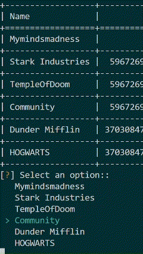
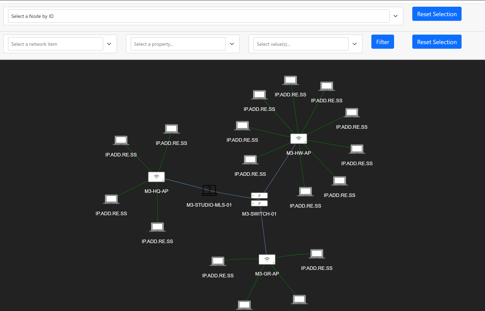

# Meraki SDK Toolkit

A simple tool kit, including a PyVis topology builder. 
This toolset using the Meraki python allowing Creation, deletion and information gathering about your meraki networks.
Aimed at Service providers to quickly onboard new organisations and networks.  

## General Instructions

To use this tool kit the following steps are required. 

- Clone the "Meraki" repository
- Create a Virtual Environment
- Create a .env file for Secrets, Each tool may require these file to be updated
- Install requirements.txt file

First clone this repository

    git clone https://github.com/MyMindsMadness/meraki.git
    
Navigate to the newly cloned directory

    cd meraki

Create a virtual environment, i like to use venv

    python3 -m venv venv

Within the new virtual environment create a ".env" and pass your API key in to the variable MERAKI_API_KEY 

    touch venv/.env
    echo MERAKI_API_KEY="your_api_key" >> venv/.env 

After having set up the your virtual environment you can now activate it.

    source venv/bin/active

Finally install all requirements from the "requirements.txt" file

    pip install -r requirements.txt

Each tool will have an individual README.md file that details any additional information required. 

## Best place to start

The Selector!

It is best to run the "organisation selector" script 

    python3 organisations/organisation_selector.py

This will ensure that the Organisation ID is loaded into the .env as "ORGANISATION_ID" which is used in many of the scripts. 

There are several different "Selector" tools will help you to dynamically pull variables in to your environment for use.

## Topology Builder

The topology builder is a great way to get a snap shot of your network. Including a visual of what devices are connected where within a 5 minute window. 

 